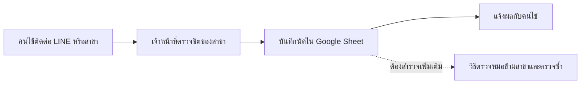

## As-Is Process (กระบวนการทำงานปัจจุบัน)

```mermaid
flowchart LR
 P[คนไข้ติดต่อ LINE หรือสาขา] --> B[เจ้าหน้าที่ตรวจชีตของสาขา]
 B --> S[บันทึกนัดใน Google Sheet]
 S --> C[แจ้งผลกับคนไข้]
 S -. ต้องสำรวจเพิ่มเติม .-> Q[วิธีตรวจหมอข้ามสาขาและตรวจซ้ำ]
```
ข้อมูลยืนยันคือชีตแยกสามสาขาและช่องทาง LINE ลำดับงานเจ้าหน้าที่ในภาพเป็นข้อเสนอสำหรับสัมภาษณ์ต่อ ไม่สรุปว่าระบบเดิมไม่ตรวจซ้ำ
