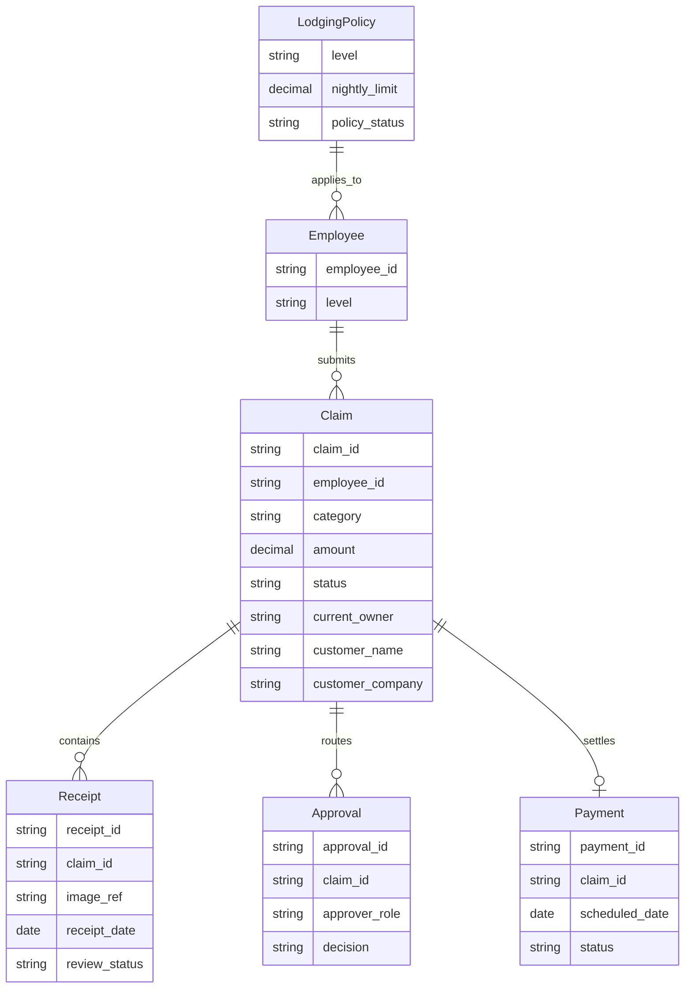

## ERD

```mermaid
erDiagram
 Employee ||--o{ Claim : submits
 Claim ||--o{ Receipt : contains
 Claim ||--o{ Approval : routes
 Claim ||--o| Payment : settles
 LodgingPolicy ||--o{ Employee : applies_to
 Employee {
  string employee_id
  string level
 }
 Claim {
  string claim_id
  string employee_id
  string category
  decimal amount
  string status
  string current_owner
  string customer_name
  string customer_company
 }
 Receipt {
  string receipt_id
  string claim_id
  string image_ref
  date receipt_date
  string review_status
 }
 Approval {
  string approval_id
  string claim_id
  string approver_role
  string decision
 }
 Payment {
  string payment_id
  string claim_id
  date scheduled_date
  string status
 }
 LodgingPolicy {
  string level
  decimal nightly_limit
  string policy_status
 }
```

LodgingPolicy.nightly_limit ยังว่างจน HR ยืนยัน ไม่ใส่ตัวเลขตัวอย่าง การจ่ายอาจยังไม่มีจนใบเบิกผ่านอนุมัติ ชื่อข้อมูลเป็นข้อเสนอจาก N1
